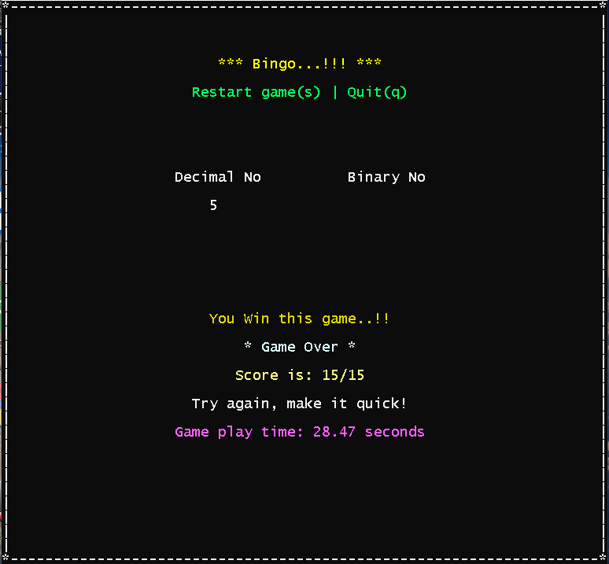

# Binary

Copyright (C) 2020 Roshankumar Bhamare<br>
www.linkedin.com/in/roshankumarbhamare

```For windows users executable (binary.exe) is provided.```

### Description

* It is a single player digital number system game in c with PDcurses.

* The game is developed and compiled on ```Windows_NT x64 10.0.18363 OS``` with ```Visual Studio Code (Version 1.45.0)```
* The compiler used: ```x86_64-w64-mingw32```
* I have used PDcurses36 for this game.

The make(.bat) file is present in folder, to compile code by a command from terminal. 
(Just type "make" followed by ENTER)

### How to start

* There are 3 screens in this game, Welcome screen, Game start and Actual Game Play
* Common Controls for all screens: Help(h), About(a), Quit(q)

* The help and about options will not work when game is in progress.

* For fresh start:
    - Use ```ENTER``` to play game for first time. 
    - Press ```s``` to start the game

* The game will stop for when wrong answer is given by user.

* To stop current game press ```ENTER```

* To replay the game, press ```s``` when displayed on screen


### Useful links
* [Decimal to binary conversion](https://www.mathsisfun.com/binary-decimal-hexadecimal-converter.html)
* [For more information about PDcurses](https://pdcurses.org/)
* [Original PDcurses repos](https://github.com/wmcbrine/PDCurses/tree/master/pdcurses)
